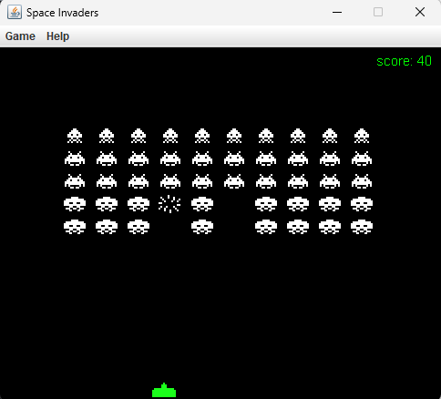
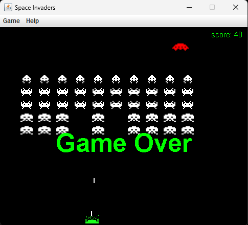

# NotSpaceInvaders

## About
> This is a space invaders like game<br>
> Written in Java using the Java swing package

## How to use
>There are compiled versions of the game in the [releases](http://github.com/Spencer-Warren/NotSpaceInvaders/releases)<br>
>You can run the jar file using this command:
``` 
java -jar SpaceInvaders.jar 
```


## Source Code
>All the source code can be found here:<br>
>[Source](SpaceInvaders/lib/src/main/java/)

## Screenshots
<details><summary>Shooting an invader</summary>
  
  
</details>
<details><summary>Game Over screen</summary>
  
  
</details>

## Video

[](http://www.youtube.com/watch?v=f2Qg2SO5gaM "Video Title")
